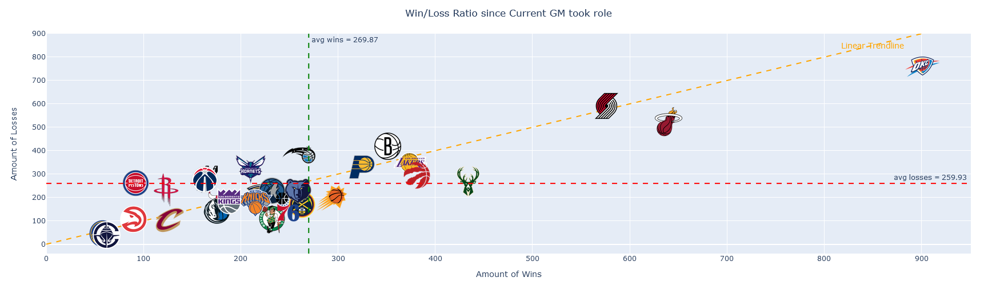

# Is this Sean Marks last chance to build a good team in Brooklyn?

*July 9. 2024*

[View my code + analysis here! (ipynb file hosted on nbviewer)](https://nbviewer.org/github/rsandan/seanmarks_analysis/blob/main/gm_landscape.ipynb) Please take a look!

I'm a Brooklyn Nets fan, and with the [2nd worst loss in Nets Franchise history against the Celtics](https://www.nydailynews.com/2024/02/14/nets-embarrassed-celtics-mikal-bridges-jayson-tatum-jacque-vaughn/) this past season, I wanted to assess whether Nets GM Sean Mark, who is approaching 10 years of being the Nets GM, knows what he is doing and whether or not we're headed in the right direction. 

**Objective:** Explore various metrics that encapsulate whether or not an NBA team's GM is doing a good job or not:
- Win Loss Record
- Playoff Appearances
- Fan Sentiment Analysis
- Salary Cap Management
- Draft Success Rate
- Trade Impact Analysis

To be continued!
